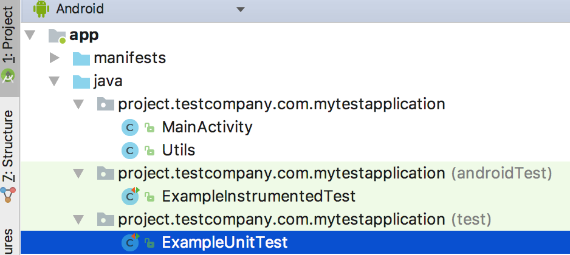
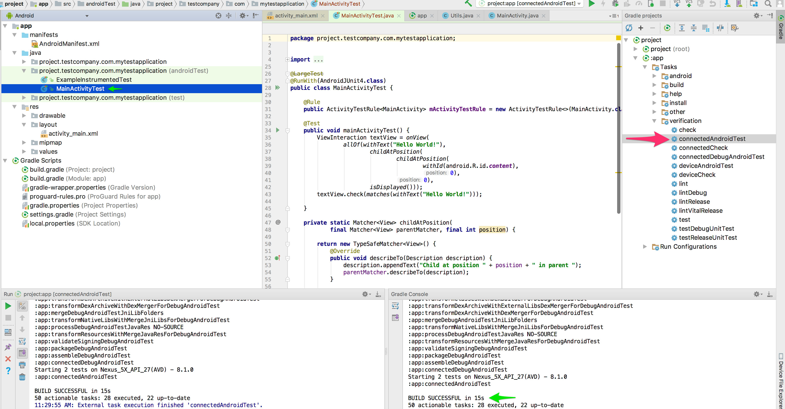

## Creating a new Android project

After downloading & installing Android Studio

1. Create a new project


1. Configure `project path`, `app name`, and the `package name` of the new project


1. Select target SDK


1. Choose one of the given activity type, in this case I will use an *Empty Activity*


## Unit test

As a preparation, I created a class file: `Utils.java`, which has my `addNumbers` function. We will test this function for now if it works as expected. (Later we will use this function for our app functionality as well.)

1. Add the file


  I've used this code snippet in the file:

  ```
  package project.testcompany.com.mytestapplication;

  public class Utils {

      public static int addNumbers(int first, int second) {
          return first + second;
      }

  }

  ```
  
1. Android Studio creates dummy test files luckily, for both UI and Unit tests. We will check `ExampleUnitTest.java` for now.
  
1. Add some testing code

	```
	package project.testcompany.com.mytestapplication;
	
	import org.junit.Test;
	import static org.junit.Assert.*;
	
	public class ExampleUnitTest {
	
	    @Test
	    public void add_isCorrect() throws Exception {
	        assertEquals(4, Utils.addNumbers(2 , 2));
	    }
	
	    @Test
	    public void add_twodigits_isCorrect() throws Exception {
	        assertEquals(44, Utils.addNumbers(22 , 22));
	    }
	
	    @Test
	    public void add_big_isCorrect() throws Exception {
	        assertEquals(4444, Utils.addNumbers(2222 , 2222));
	    }
	    
	}
	```
1. Run Unit tests and check the results
   
 You have multiple choices to run the tests:
 1. Via Terminal: `cd` to the root dir of the project and run `./gradlew test`
   
 1. Using Android Studio, for example from the project window:
   
   
 The report will be generated under the same path for both case: `PROJECT_ROOT_DIR/app/build/reports/tests/testDebugUnitTest/index.html`
 
 If all of your tests ran successfully you will see something like this:
 
 
 
 
 But if you have a failed test case then it can be very helpful too see which one failed and what was the error, so I made a mistake to see what it looks like:
 
 
 
 
 
 also the details are available:
 
 
 
## UI Test

UI test is really useful if we wan't to skip physical testing by clicking through the UI. This is one of the best methods to check what happens on the screen for example when you tap on a button.

First of all we need to start the test "record".


Now we need to select device to run the recording on. I have an emulator already, so I select that one.


Then click on add assertion button.


You will see now that the app will launch on the device and after a short loading, the screen of the app will show. This is an interactive "screenshot" where you can click on the "testable" object.

I select (the only one) `Hello World` TextView on the screen to check if it's content is `Hello World` for sure. As you can see it is automatically detected all the fields in the **Edit Assertion** section. Looks good, click on **Save Assertion**.


Click **Ok** and close the popup window in which you can see your assertion list.
Finally it will ask for a class name with a java file will be created and in which your test code will be generated. You need to have something like this:



Now you can run your UI test by selecting `connectedAndroidTest` from the gradle console or by running `./gradlew connectedAndroidTest` in terminal.


The generated reports are available under `PROJECT_ROOT_PATH/app/build/reports/androidTests/connected/index.html` path. To see how a test report looks like if successful/failed, check the end of the **Unit Test** section above.
 
## Store your code on one of the source control services

We use Github in this tutorial. To be able to do this, you will need a fully configured git and a basic knowledge of using a terminal (of the couple of commands that we will run). Should you need it, check out this great tutorial: [Adding an existing project to GitHub using the command line](https://help.github.com/articles/adding-an-existing-project-to-github-using-the-command-line)

What you need to push to the repository is the content of the project's root directory. You will have a structure similar to this:


After you've run these commands:

```
cd "to the project root path"
git init
git add .
git commit -m "First commit"
git remote add origin your-repo-remote-url-here
git push -u origin master
```

... you should have something like this in your remote:


## Add your project on Bitrise

1. Create a new app on Bitrise
   
1. Select your repository
   
   > You will be asked to connect your Github account if you haven't already.
   
1. Setup SSH access, if you need something custom you can select `ADD OWN SSH`, otherwise just go for the `No, auto-add SSH key` option.
1. Specify the branch for scanning: our main code base was pushed to the master branch, so we'll go with master for now. Then click **Next**.
   
   > After clicking Next the validation of your repository will be started. Bitrise will check if your git repository is fully accessible, and will scan for your project type to create the best configuration for your needs.
1. Oh.. an Android project detected
   
   > just click **Next**, then **Confirm**
1. Decide if you want webhooks added for your repository by Bitrise or not
   > Registering webhooks basically wires your project's "source control events" from Github to Bitrise. This way Bitrise can be triggered, for example, by pushing some new code to one of your branches, or by other trigger events.
1. The first build has just been started!
   
   Click on the big green button! What you will see now is the build page.
   
   The **primary** workflow will run on the code from your **master** branch:
   
   
   To access your current workflows click on the `Workflow` tab.
   The initial workflows are: primary and deploy. Both do the same with a little difference. Primary workflow has a configured `gradle-runner` to run the gradle task **assembleDebug**, deploy workflow has the gradle task **assembleRelease**.
   
   
## Configure your workflow to run Unit Test

Prevously we've learnt that if we wan't to run our unit test we need to call `./gradlew test` command. To do it on Bitrise just simply replace `assembleDebug` with `test` in the Gradle Runner step's gradle task input.

Ok.. Now we have our primary workflow configured to run test gradle task. But what about the test reports? Previously we also found out that the test reports are located under the path of: `PROJECT_ROOT_DIR/app/build/reports/tests/testDebugUnitTest/index.html`

The `PROJECT_ROOT_DIR` part of the path on Bitrise is the `$BITRISE_SOURCE_DIR` environment variable. Bitrise has couple of environment variables used around, to see the complete list wisit this page: [Environment Variables](http://devcenter.bitrise.io/faq/available-environment-variables/)

The another environment variable that we will need is `$BITRISE_DEPLOY_DIR`, if you copy any file in this directory, that will be exported to your build artifacts by the **Deploy to Bitrise.io** step. (In your build #1 you should also have the debug apk that generated previously by the `assembleDebug` task.)


So finally to get your report in your artifacts, add a **Script** step after your **Gradle Runner** step. (by clicking on the **+** button under **Gradle Runner**) and add the command to the Script step's content input:

```
zip -r $BITRISE_DEPLOY_DIR/reports.zip $BITRISE_SOURCE_DIR/app/build/reports/tests/testDebugUnitTest
```

Also turn on **Run if previous Step failed** option, so you can export the generated report even if your unit test failed.


Now click on save, close the workflow editor, then start a new build from the master branch with the primary workflow by clicking on **Start/Schedule a Build** button.


Finally click on **Start Build** and let's wait for the result.

Oh... NOOO! It failed...

So we can download our reports by clicking on the download button, let's see what's going on...

This is the issue I made intentionally to see how a failed test case looks like.


We will fix this on Github in the online editor. This way we will also check if we fix the code on Github and after the committed change it should start a new build automatically.


And as we can see a new build is just started automatically with the fresh code. It should be successful now. After couple of minutes we have the result of our hard work now:


also the test report is 100%


## Configure your workflow to run UI Test


### Using AVD Manager step (running on emulator)

Prevously we've learnt that if we wan't to run our UI test we need to call `./gradlew connectedAndroidTest` command. To do it on Bitrise just simply replace `assembleDebug` with `connectedAndroidTest ` in the Gradle Runner step's gradle task input.

Ok.. Now we have our primary workflow configured to run UI Test gradle task. But what about the test reports? Previously we also found out that the test reports are located under the path of: `PROJECT_ROOT_PATH/app/build/reports/androidTests/connected/index.html`

The `PROJECT_ROOT_DIR` part of the path on Bitrise is the `$BITRISE_SOURCE_DIR` environment variable. Bitrise has couple of environment variables used around, to see the complete list wisit this page: [Environment Variables](http://devcenter.bitrise.io/faq/available-environment-variables/)

The another environment variable that we will need is `$BITRISE_DEPLOY_DIR`, if you copy any file in this directory, that will be exported to your build artifacts by the **Deploy to Bitrise.io** step. (In your build #1 you should also have the debug apk that generated previously by the `assembleDebug` task.)


So finally to get your report in your artifacts, add a **Script** step after your **Gradle Runner** step. (by clicking on the **+** button under **Gradle Runner**) and add the command to the Script step's content input:

```
zip -r $BITRISE_DEPLOY_DIR/reports.zip $BITRISE_SOURCE_DIR/app/build/reports/tests/testDebugUnitTest
```

Also turn on **Run if previous Step failed** option, so you can export the generated report even if your unit test failed.


What's left is to start the emulator in time, and make sure it is running fine before we start using it. So it is highly recommended to start the emulator within one of the first steps(I usually make it to be #1) so it has the time to boot until we need it basically. We will use Wait for Android Emulator step to validate and/or wait for the emulator to finish booting, right before we need it(before running the gradle task on it). It will look like this:


Now click on save, close the workflow editor, then start a new build from the master branch with the primary workflow by clicking on **Start/Schedule a Build** button.


Finally click on **Start Build** and let's wait for the result.


### Using Virtual Device Testing for Android step (without emulator)

First of all we will need to enable Android UI Testing on the app's settings tab:


Then add an extra gradle task: assembleDebugAndroidTest in Gradle Runner step's gradle task input field:


Now we will have the app APK and the test APK generated that can be sent out for 3rd party testing services.
Add **Virtual Device Testing for Android** step after gradle runner, so it will send the APKs for testing.
Make sure you have selected `instrumentation` as test type in the step.


Now click on save, close the workflow editor, then start a new build from the master branch with the primary workflow by clicking on **Start/Schedule a Build** button.


Finally click on **Start Build** and let's wait for the result.

As soon as the running build reaches **Virtual Device testing for Android** step you will be able to see the dashboard of your running test. The extra details will be available as soon as the test finished.
After the build finished, click on the `Virtual Device Tests [beta]` tab:


And after that you can see all the details of your test:
  

